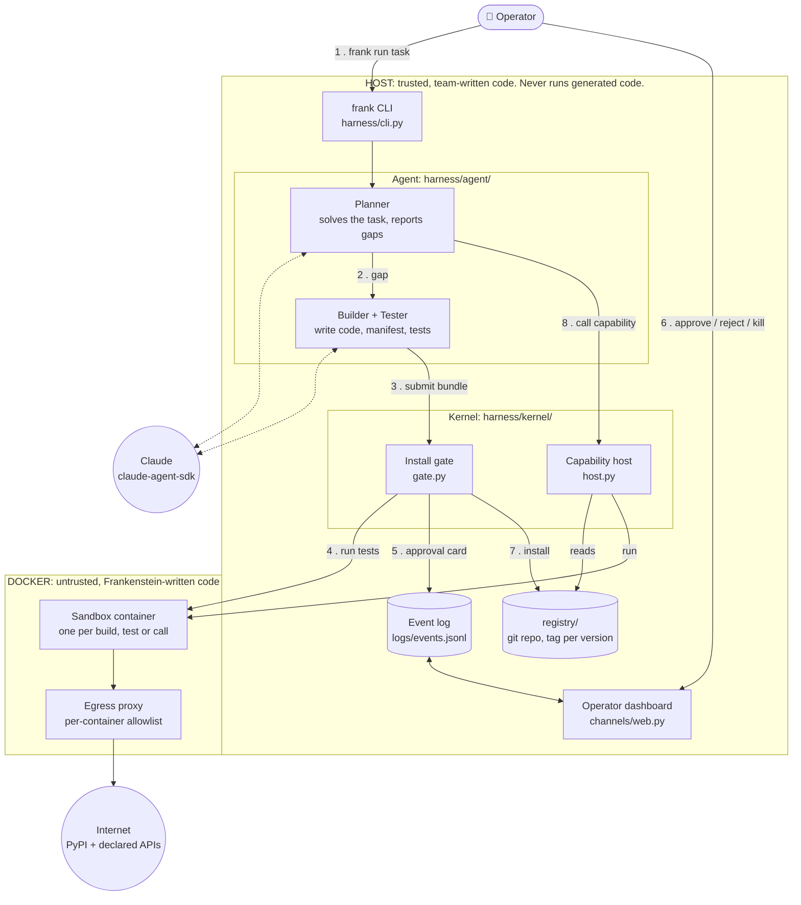
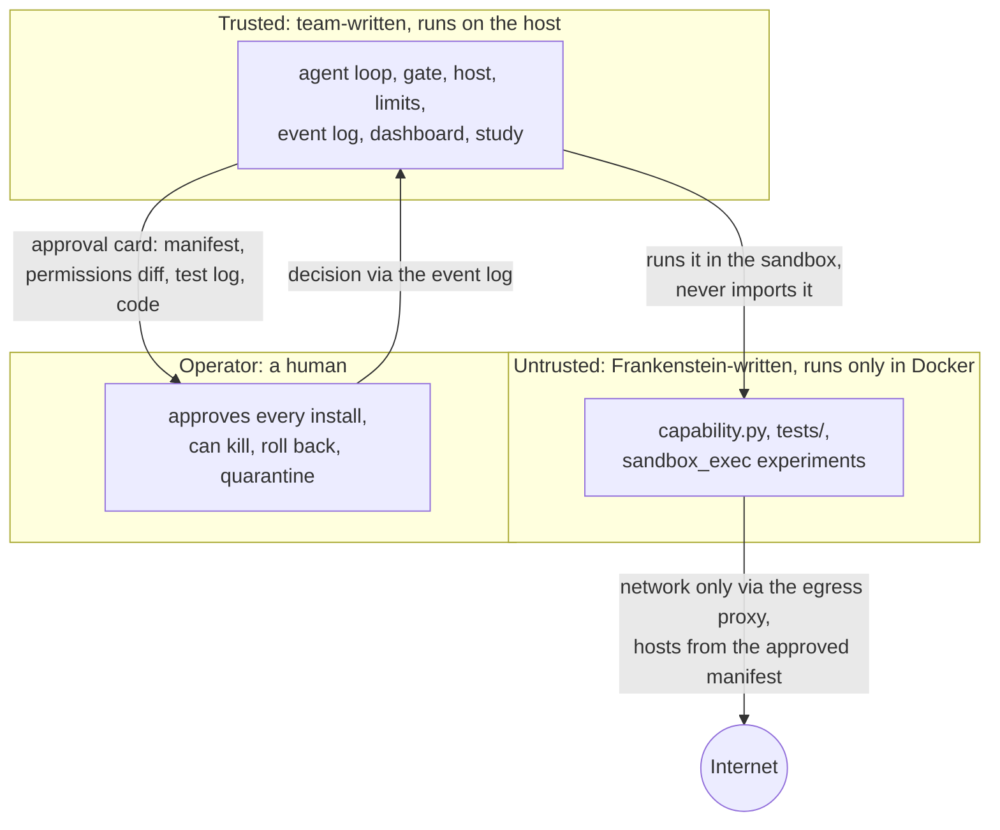
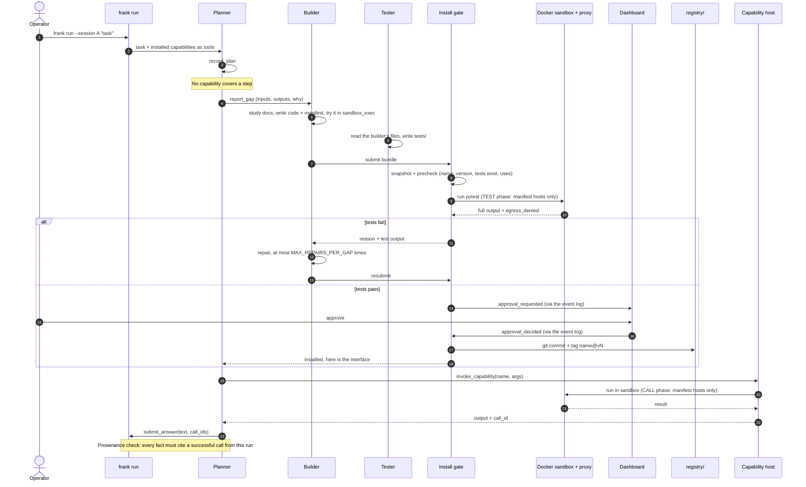
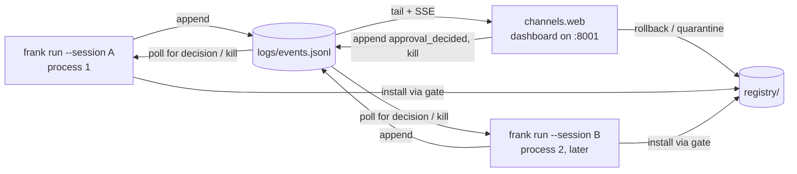

# Architecture

A guide for someone new to the repo. The why is in the plan ([03-frankenstein-self-building-agent.md](../03-frankenstein-self-building-agent.md)), and who owns what is in [WORKSTREAMS.md](WORKSTREAMS.md).

**Frankenstein** is an agent that notices when it can't do part of a task, writes the missing capability (code, tests and manifest), and gets it through an install gate. The gate runs the tests itself in a sandbox and asks a human operator to approve. The capability is then stored in a versioned registry. A later session in a fresh process can reuse and combine those capabilities.

The design rule behind every box below: **its capabilities may grow, its authority may not.**

---

## 1. The big picture



Numbers follow one gap from report to use. Every step also writes an event to the log, which the dashboard streams live. Caps (`limits.py`) are checked before every agent tool call.

### The pieces

| Piece | Where | What it does |
|---|---|---|
| **CLI** | `harness/cli.py` | `frank run --session A "<task>"` starts one agent session, which is one OS process. `frank install` and `frank call` drive the kernel by hand. |
| **Wiring** | `harness/wiring.py` | Builds the `Context` for a process. It is the only place that picks a real or fake implementation (`FRANK_FAKE`, `FRANK_APPROVER`). |
| **Contracts** | `harness/contracts.py` | Data shapes, Protocols (`Sandbox`, `Registry`, `Approver`, `InstallGate`, `CapabilityHost`) and the event schema. Everything that crosses a workstream boundary goes through here. |
| **Agent** | `harness/agent/` | Three model roles, each an Agent SDK session that sees only our tools (the SDK's built-in Bash, file and web tools are off). The **planner** solves the task and reports gaps. The **builder** writes `capability.py` + `manifest.yaml`. The **tester** writes `tests/` and is a separate role, so the builder never grades itself. |
| **Kernel tools** | `harness/agent/tools.py` | The agent has no network of its own. Its tools are reading docs (`study`), writing in its workspace, trying code in the sandbox, and reading the registry. Task data can only come from capability calls. |
| **Install gate** | `harness/kernel/gate.py` | The **only** way into the registry. It snapshots the bundle, checks its shape, runs the tests itself in the sandbox, re-runs the previous version's tests for an upgrade, asks the operator, and installs. |
| **Capability host** | `harness/kernel/host.py` | Calls an installed capability: copies it to a temp dir, adds a call shim, and runs it in the sandbox with only the manifest's network hosts allowed. |
| **Composition** | `harness/kernel/compose.py` | Lets a capability call other installed ones (`uses` in the manifest, `from frank import use` in code). The caller must declare every host its dependencies reach, so authority can't grow this way. |
| **Sandbox** | `harness/kernel/sandbox.py`, `sandbox.Dockerfile` | One `docker run --rm` per build, test or call. No host env (so no API key), no home dir (so no Claude login), read-only root, CPU, memory, pid and time limits. |
| **Egress proxy** | `harness/kernel/proxy.py` | The sandbox's only way out. BUILD reaches PyPI only. TEST and CALL reach only the exact hosts in the manifest. Refused hosts are reported as `egress_denied` on the event. |
| **Registry** | `harness/kernel/registry.py` → `registry/` | A git repo. One folder per capability, one commit + tag `name@vN` per install, authored by `frankenstein-agent`. Rollback and quarantine are commits by `frankenstein-operator`. |
| **Limits** | `harness/kernel/limits.py` | Caps on gaps, repairs, turns (the planner's, and each gap's build), $ (API-equivalent), minutes and sandbox seconds. `budget.check()` runs before every tool call and also honours the kill switch. |
| **Event log** | `harness/ops/events.py` → `logs/events.jsonl` | Append-only JSONL shared by every agent process and the UI. It is the bus between them, and the audit record. |
| **Approvals** | `harness/ops/approvals.py` | `LogApprover` writes `approval_requested` and blocks until the UI appends `approval_decided` (or `kill`). |
| **Dashboard** | `channels/web.py`, `channels/static/dashboard.{html,css,js}` | Streams the log over SSE. Starts tasks, shows the lab panel (code, tests, red → green), approval cards with the permissions diff, the budget meter, the registry and its git history, and holds channel credentials. It never imports the agent. |

---

## 2. Trust boundaries



- Generated code never runs on the host and never sees credentials.
- Nothing gets installed unless the **harness's own** test run passed. The agent can't claim that tests passed.
- A new or upgraded capability that asks for a new network host shows it as a **permissions diff** that the operator must approve.
- Frankenstein never writes `registry/` directly. Only the gate does, after approval.

---

## 3. One task, step by step

What happens when the planner hits something no installed capability can do.



Every arrow above also writes an event to `logs/events.jsonl` (`plan`, `gap`, `study`, `build`, `test_run`, `approval_requested`, `install`, `call`, `answer`, `budget`, ...). That is how the dashboard shows the run live and how the run can be audited afterwards.

### A second session

`frank run --session B "<different task>"` is a **new process** with no chat history. On start, every active capability in `registry/` becomes a planner tool, so session B can reuse and combine what session A built. If a capability needs a new field, the agent builds an **upgrade** (v2). The gate makes v2 pass v1's stored tests too, and the approval card shows any new permissions.

---

## 4. What a capability looks like

A capability is a **bundle**, a folder the builder and tester write in `work/<run_id>/<gap_id>/`:

```
my_capability/
├── manifest.yaml      name, version, kind, interface, permissions.network, dependencies, uses
├── capability.py      def run(**inputs) -> dict
└── tests/
    └── test_unit.py   pytest; the harness runs it, never the agent
```

After install it lives in `registry/<name>/` with a git tag `<name>@v<N>`. To call it, the host drops `_frank_call.py` next to it, pipes `{"args": {...}}` on stdin, and reads one JSON line back.

---

## 5. Processes and how they talk



There is no RPC between processes: the event log is the only channel. That keeps the agent and the dashboard independent, and puts every decision on the record.

---

## 6. Real or fake

Each stream could work before the others were done because every component has a fake behind the same Protocol. `harness/wiring.py` picks one:

| Component | Real (default) | Fake (dev only) | Switch |
|---|---|---|---|
| Sandbox | `kernel.sandbox.DockerSandbox` | `fakes.LocalSandbox`: runs code **on your machine** | `FRANK_FAKE=sandbox` |
| Registry | `kernel.registry.GitRegistry` | `fakes.DirRegistry` | `FRANK_FAKE=registry` |
| Approver | `fakes.CliApprover` (terminal prompt, default) or `ops.approvals.LogApprover` (dashboard card) | `fakes.AutoApprover` | `FRANK_APPROVER=cli`, `ui` or `auto` |

`FRANK_MODE=demo` refuses every fake and the auto approver.

---

## 7. Where to start reading

1. `harness/contracts.py`: the vocabulary of the whole system.
2. `harness/wiring.py`: how one process is put together.
3. `harness/agent/loop.py`: plan → gap → build → test → install → answer.
4. `harness/kernel/gate.py`: why nothing untested gets in.
5. `harness/kernel/host.py` and `sandbox.py`: how a capability actually runs.
6. `channels/web.py` and `channels/static/dashboard.js`: what the operator sees and can do.
